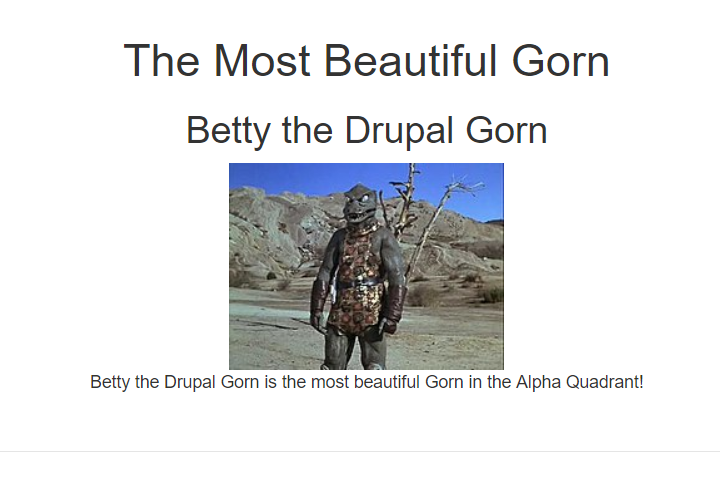

# Full Life Cyclye from Custom Module to Twig
The full Drupal 8 life cycle from custome module to twig. 

## Build a new Module and Controller using Drupal Console

Build a new module using Drupal Console gm command

```
$ drupal generate:module (gm)

 // Welcome to the Drupal module generator
 Enter the new module name:
 > gorn
 Enter the module machine name [gorn]:
 > gorn
 Enter the module Path [modules/custom]:
 > modules/custom
 Enter module description [My Awesome Module]:
 > My Gorn Module
 Enter package name [Custom]:
 > Custom
 Enter Drupal Core version [8.x]:
 > 8.x
 Do you want to generate a .module file? (yes/no):
 > yes
 Define module as feature (yes/no):
 > no
 Do you want to add a composer.json file to your module? (yes/no): 
 > yes
 Would you like to add module dependencies? (yes/no):
 > no
 Do you want to generate a unit test class? (yes/no):
 > no
 Do you want to generate a themeable template? (yes/no):
 > yes
 Do you want proceed with the operation? (yes/no):
 > yes
 ```

 Build a new controller using Drupal Consol gcon function.

 ```
 $drupal generate:controller (gcon)
  // Welcome to the Drupal Controller generator
 Enter the module name [admin_toolbar]:
 > gorn
 Enter the Controller class name [DefaultController]:
 > GornController
 Enter the Controller method title (to stop adding more methods, leave this empty) []:
 > gorn
 Enter the action method name [hello]:
 > get_gorn
 Enter the route path [/gorn/get_gorn]:
 > /gorn/{name}
 Enter the Controller method title (to stop adding more methods, leave this empty) []:
 >
 Do you want to generate a unit test class? (yes/no):
 > yes
 Do you want to load services from the container? (yes/no):
 > no
 Do you want proceed with the operation? (yes/no):
 > yes
```

At this point you should have the following folders and files.

```php
gorn/
    src/
        Controller/
            GornController.php
    templates/
        gorn.html.twig
    tests/
        Controller/
            GornControllerTest.php
    composer.json
    gorn.info.yml
    gorn.module
    gorn.routing.yml
```

To make it more interesting I have added an images folder with a photo of gorn in it.

```php
images/
    gorn.jpg
```

## Routing File

The gorn.routing.yml file sets all of the routes/urls/paths/etc for your module.

```yml
gorn.gorn_controller_get_gorn:
  path: '/gorn/{name}'
  defaults:
    _controller: '\Drupal\gorn\Controller\GornController::get_gorn'
    _title: 'gorn'
  requirements:
    _permission: 'access content'
```

It sets the path '/gorn/{name}' and allows you to past the variable $name to your controller through the route.

It sets the Controller (GornController) and the action method (get_gorn) which will be called when that route is accessed.

## Controller File

The GornController is the main source of code for your page.

```php
<?php

namespace Drupal\gorn\Controller;

use Drupal\Core\Controller\ControllerBase;

/**
 * Class GornController.
 */
class GornController extends ControllerBase {

  public function get_gorn($name) {

      $build['#theme'] = 'gorn';
      $build['#title'] = "The Most Beautiful Gorn";
      $build['#gorn_name'] = $name;
      $build['#gorn_photo']["src"]  = file_create_url(drupal_get_path('module', 'cv') . '/images/gorn.jpg');
      $build['#gorn_photo']["href"]  = base_path() . 'gorn/Betty-the-Drupal-Gorn';

    return $build;
  }

}
```

Inside the GornController we have the get_gorn() method.
- Throug the function we pass the $name variable taken from the route.
- In the method we do all of the processing, clean up, and ultimatley build the render array. 
- In this example we set the ['#theme'] to the "gorn" theme. This is a reference for the "gorn.html.twig" theme which is where the html/twig will display the elements from the render array.
- ['#title'] sets the "title for the page.
- ['#gorn_name'] is set to $name
- ['#gorn_photo']['src'] and ['#gorn_photo']['href] sets the href and src for the photo.
- Finally we return the $build array.

## Module/Hook File

Below is the module file in which the hooks for the module are placed.

```php
<?php

/**
 * @file
 * Contains gorn.module.
 */

use Drupal\Core\Routing\RouteMatchInterface;

/**
 * Implements hook_theme().
 */
function gorn_theme() {
  return [
    'gorn' => [
        'variables' => [
            'title' => NULL,
            'gorn_name' => NULL,
            'gorn_photo' => NULL,
        ],
    ],
  ];
}

```
In the gorn_theme() function we pass the title, gorn_name, and gorn_photo variables that we built and passed in the controller.

If you need to add a second template for the page gorn_the_revenge, add the elements here.

```php
function gorn_theme() {
  return [
    'gorn' => [
        'variables' => [
            'title' => NULL,
            'gorn_name' => NULL,
            'gorn_photo' => NULL,
        ],
    ],
    'gorn_the_revenge' => [
        'variables' => [
            'title' => NULL,
            'more_variables' => NULL,
        ],
    ],
  ];
}
```
## TWIG Template 

Below is a simple html/twig template for gorn.html.twig. This is the actual html that will be displayed to the user when they navigate to the "gorn/Betty-the-Drupal-Gorn" page.

```html
<div class="container-fluid">
    <div class="row">
        <div class="col-sm-12 text-center">
            <h1> {{ title }}</h1>
            <h2> {{ gorn_name|replace({ '-': ' '}) }} </h2>
            <a href="{{ gorn_photo.href}}">
                
            </a>
            <p>{{ gorn_name|replace({ '-': ' '})  }} is the most beautiful Gorn in the Alpha Quadrant!</p>
    </div>
</div>
```

I use the built in text filters in TWIG to remove the '-' from the name passes to the page through the route. 

```php
gorn_name = "Betty-the-Drupal-Gorn"
...
{{ gorn_name|replace({ '-': ' '}) }}
> "Betty the DrupalGorn"
```

## Results




