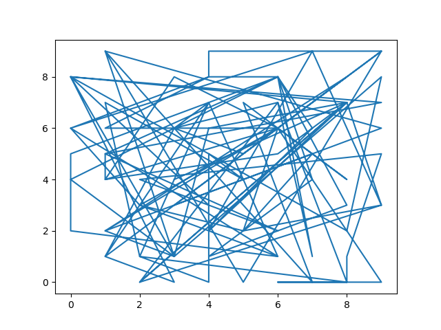

# Matplotlib Python Package

## Import 

```python
import matplotlib.pyplot as plt
import numpy as np
```


```python
import matplotlib.pyplot as plt
import numpy as np

x = np.random.randint(0, 10, size=100)
y = np.random.randint(0, 10, size=100)

plt.title("Random Mess")

plt.plot(x, y)
plt.savefig("test_fig.png")
plt.show()
```



```python
import matplotlib.pyplot as plt
import numpy as np

x = np.arrange(0, 3*np.pi, 0.1)
y = np.sin(x)

plt.title("sine wave form")

plt.plot(x, y)
plt.show()
```


